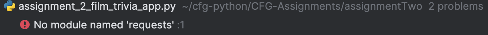

## Assignment Two
### Introduction
This is the directory for my second assignment. I chose to make a [Film Trivia Quiz App](assignment_2_film_trivia_app.py) using the [Open Trivia Database API](https://opentdb.com/api_config.php).

### How to use the app
**Ellen's Film Trivia Quiz App** will ask you three randomised trivia questions, asking you to select
one of four possible answers. The app will tell you whether you answered each question correctly, and also
write each question and correct answer to a file, that records your score and acts as a 
[Certificate of Participation](certificate_of_participation.txt) at the end (this is overwritten each time you play). 
> [!TIP]
> If you do not type an integer between 1-4 corresponding to an answer for each question, the question will be recorded
> as wrong - so type carefully!

### How to download additional modules
You may receive an error message like this one below:  
  
This means you need to download an additional module (in this example, I needed to download the `requests`
module) in order to run the python file. To do so, you can use `pip`, by typing in the following command 
to your terminal (replacing `requests` with the module you wish to install):
```commandline
sudo pip3 install requests
```
I've saved a screenshot of my own command in the [Screenshots Directory](screenshots) too.  
> [!NOTE]
> `sudo` was used here because my laptop is a Mac, users of other systems may need to replace 
> this with `-m`.  

### Conclusion
I hope you enjoy **Ellen's Film Trivia Quiz App**! :grinning: :movie_camera:
